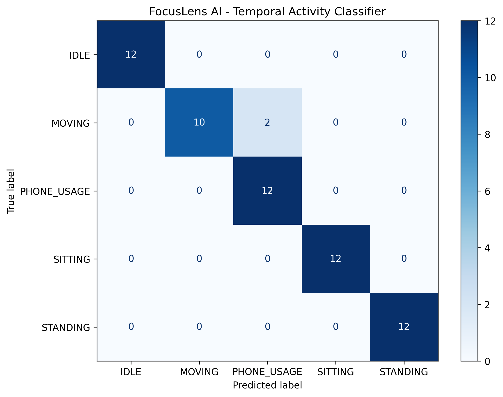

# 🎯 FocusLens AI

### Real-Time Computer Vision System for Attention, Activity, Posture & Ergonomic Analysis

FocusLens AI is an intelligent real-time computer vision system that uses webcam input to analyze visual attention, eye gaze, blink activity, drowsiness indicators, body posture, physical activity, distraction, and ergonomic conditions.

The system combines **Python, OpenCV, MediaPipe, and Machine Learning** to provide real-time analysis and feedback through an interactive OpenCV dashboard.

---

## 📖 Overview

FocusLens AI continuously processes webcam frames and combines facial landmarks, iris landmarks, pose landmarks, rule-based analysis, and machine learning to understand different aspects of user behavior.

The system provides real-time information about:

- 👁️ Eye gaze direction
- 👀 Blink detection
- 🧠 Attention level
- 🙂 Head direction
- 😴 Drowsiness indicators
- 🧍 Body posture
- 🪑 Ergonomic risk
- 🚶 Physical activity
- 📱 Phone usage
- ⚠️ Distraction
- 🔔 Smart alerts
- 💡 Live recommendations
- 📊 Session statistics

---

---

## 🔄 How It Works

FocusLens AI follows a real-time computer vision pipeline to analyze visual attention, posture, activity, and ergonomic conditions.

```text
Webcam Input
     ↓
Face & Pose Detection
     ↓
Facial / Iris / Pose Landmarks
     ↓
┌─────────────────────────────┐
│ Attention Analysis          │
│ Eye Gaze & Blink Detection  │
│ Drowsiness Detection        │
│ Posture Analysis            │
│ Ergonomic Analysis          │
│ Activity Recognition        │
└─────────────────────────────┘
     ↓
Temporal Activity Model
     ↓
Smart Alerts & Recommendations
     ↓
Real-Time Dashboard
```

# ✨ Key Features

## 👤 1. Face Detection

The system uses the **MediaPipe Face Landmarker** to detect facial landmarks in real time.

Facial landmarks are used for:

- Eye tracking
- Gaze estimation
- Blink detection
- Head direction
- Attention analysis

---

## 👁️ 2. Eye Gaze Detection

FocusLens AI estimates the approximate direction of the user's gaze using facial and iris landmarks.

Supported directions:

- ⬅️ LEFT
- ➡️ RIGHT
- ⬆️ UP
- ⬇️ DOWN
- 🎯 CENTER

The gaze information contributes to attention and distraction analysis.

---

## 🧭 3. Head Direction Detection

The system analyzes facial geometry to estimate the direction of head movement.

Possible directions include:

- 🎯 CENTER
- ⬅️ LEFT
- ➡️ RIGHT
- ⬆️ UP
- ⬇️ DOWN

A short calibration stage establishes a neutral reference position for the user.

---

## 🧠 4. Attention Detection

FocusLens AI combines head direction and eye gaze to calculate an attention score.

The dashboard displays:

- 📊 Attention score
- 🎯 Attention status
- 👁️ Eye direction
- 🧭 Head direction

Possible attention states include:

- FOCUSED
- DISTRACTED
- LOW ATTENTION

The attention score is a computer-vision-based prototype indicator and is not a psychological or clinical measurement.

---

## 😉 5. Fast Blink Detection

Blink detection is implemented using the **Eye Aspect Ratio (EAR)**.

The system tracks:

- Eye ratio
- Eye state
- Blink count
- Blink rate

The blink detector is designed for fast real-time response to short eye closures.

---

## 😴 6. Drowsiness Detection

The drowsiness module monitors prolonged eye closure and attention-related conditions.

Possible states include:

- 🟢 ALERT
- 🟡 WARNING
- 🟠 LOW ALERTNESS
- 🔴 DROWSY

The system can generate an alert when prolonged eye closure is detected.

> This feature provides visual indicators and is not intended for medical diagnosis.

---

## 🧍 7. Posture Detection

The system uses MediaPipe pose landmarks to analyze body posture.

Detected posture conditions include:

- 🟢 GOOD POSTURE
- 🔴 SLOUCHING
- 🟠 LEANING
- 🟡 SHOULDERS UNEVEN

The analysis considers:

- Neck angle
- Shoulder alignment
- Torso orientation

---

## 🪑 8. Ergonomic Analysis

FocusLens AI monitors posture-related measurements and tracks the duration of unfavorable posture.

The system analyzes:

- 📐 Neck angle
- 📐 Shoulder alignment
- 📐 Torso angle
- ⏱️ Bad-posture duration
- ⚠️ Ergonomic risk

Possible ergonomic states include:

- GOOD
- LOW RISK
- MODERATE RISK
- HIGH RISK

The thresholds used are prototype engineering thresholds and are not medical or professional ergonomic standards.

---

# 🤖 9. Temporal Activity Recognition

FocusLens AI includes a machine-learning-based temporal activity recognition system.

Instead of classifying a single frame, the system analyzes a sequence of **30 consecutive pose frames**.

### Activity Classes

The current model recognizes:

- 🪑 SITTING
- 🧍 STANDING
- 💤 IDLE
- 🚶 MOVING
- 📱 PHONE_USAGE

### Temporal Feature Configuration

- Sequence length: **30 frames**
- Base features per frame: **15**
- Temporal features per sequence: **138**
- Number of activity classes: **5**

The temporal feature extractor uses statistical and motion-based information from consecutive frames.

---

# 10. Activity Dataset

The current dataset contains **300 temporal activity sequences**.

- 📦 300 sequences
- 🏷️ 5 activity classes
- ⚖️ 60 sequences per class
- 🎞️ 30 frames per sequence
- 🔢 138 temporal features per sequence
The dataset is balanced across all five activity classes.

Each sequence contains:

- 30 consecutive pose frames
- 138 temporal features
- 1 activity label

---

# 11. Machine Learning Model

The temporal activity recognition model uses a:

**Random Forest Classifier**

---

# 📈 12. Model Evaluation

The Temporal Activity Recognition model was evaluated using an 80/20 stratified train-test split.

### Evaluation Setup

- Total sequences: **300**
- Training sequences: **240**
- Testing sequences: **60**
- Number of activity classes: **5**
- Features per sequence: **138**
- Model: **Random Forest Classifier**

###📐Evaluation Metrics

The model was evaluated using:

- Accuracy
- Precision
- Recall
- F1-score
- Confusion Matrix

###🏆 Results

**Test Accuracy: 96.67%**

The model achieved an overall test accuracy of **96.67%** on the current test set of 60 sequences.

### Confusion Matrix

The confusion matrix shows the classification performance of the model across the five activity classes.



### Evaluation Note

The reported accuracy is based on the current collected dataset and the 80/20 stratified train-test split.

Performance may vary depending on:

- 👤 Different users
- 📷 Camera position
- 💡 Lighting conditions
- 🧍 Body visibility
- 🏠 Background
- 🌐 Recording environment
- 🎥 Unseen sessions

A person-separated or session-separated evaluation can be performed in future work to provide a stronger estimate of model generalization.

---

## 🚨 Smart Alert System

The Smart Alert System generates real-time alerts when specific conditions persist during the monitoring session.

The system can detect:

- ⚠️ Looking away from the screen
- 🚨 Extended distraction
- 🧍 Correct your posture
- 🪑 Take a posture break
- 😴 Possible drowsiness detected
- 📷 Please position yourself in front of the camera
- 👤 Please ensure your body is visible

### Alert Severity Levels

- **INFO** – General informational feedback
- **WARNING** – Condition requiring attention
- **CRITICAL** – Condition requiring immediate correction

A cooldown mechanism is used to reduce repeated alerts for the same condition.

---

## 💡Live Recommendations

FocusLens AI provides real-time recommendations based on the detected user condition.

Examples include:

- 🧍 Sit upright and straighten your back.
- 🪑 Try to maintain a balanced sitting position.
- 👀 Please focus your attention on the screen.
- 😴 Take a short break and stay alert.
- 📱 Avoid unnecessary phone usage during your session.
- 👍 Maintain your current posture and attention.
The recommendation system dynamically changes the displayed message according to the current detection results.

---

## 👀 Distraction Tracking

The system tracks periods of distraction using multiple visual signals:

- 🧭 Head direction
- 👁️ Eye direction
- 🧠 Attention status

The duration of continuous distraction is monitored and can be used by the Smart Alert System to generate appropriate alerts.

---

## ⏱️Session Tracking

FocusLens AI maintains session-level statistics during a monitoring session.

The system tracks:

- ⏱️ Session duration
- 🎯 Attention information
- 👀 Distraction duration
- 😉 Blink information
- 🧍 Posture information
- 🤖 Activity information
- 🚨 Alert count

These statistics provide an overview of the user's behavior throughout the session.

---

## 🖥️ Real-Time Dashboard

The main application provides an OpenCV-based real-time dashboard for monitoring all major system outputs.

The dashboard displays:

```text
FPS
Attention
Eye Direction
Head Direction
Blink Count
Blink Rate
Drowsiness
Posture
Activity
Activity Confidence
Ergonomic Risk
Face Detection
Body Detection
Calibration Status
Alerts
Recommendations

---
```
## 🛠️ Technology Stack

### 🐍 Programming Language

- Python 3.10.11

### 👁️ Computer Vision

- OpenCV
- MediaPipe Tasks

### 🤖 Machine Learning

- Scikit-learn
- Random Forest Classifier

### 🔢 Data Processing

- NumPy
- Pandas

### 📊 Visualization

- Matplotlib

### 💾 Model Persistence

- Joblib

### 🖼️ Image Processing

- Pillow

---

## 📁 Project Structure

```text
FocusLens-AI/
│
├── data/
├── models/
├── outputs/
│   └── temporal_activity_confusion_matrix.png
│
├── src/
│   ├── activity_detection.py
│   ├── attention_analysis.py
│   ├── attention_test.py
│   ├── blink_detection.py
│   ├── calibration_status.py
│   ├── detection_status.py
│   ├── distraction_tracker.py
│   ├── drowsiness_detection.py
│   ├── ergonomics.py
│   ├── ergonomics_test.py
│   ├── evaluate_temporal_activity_model.py
│   ├── eye_tracking.py
│   ├── face_detection.py
│   ├── fps_counter.py
│   ├── head_pose.py
│   ├── integrated_pose_system.py
│   ├── live_recommendation.py
│   ├── main.py
│   ├── pose_detection.py
│   ├── posture_analysis.py
│   ├── session_tracker.py
│   ├── smart_alerts.py
│   ├── temporal_activity_collection.py
│   ├── temporal_activity_engine.py
│   ├── temporal_activity_features.py
│   ├── temporal_activity_live.py
│   ├── test_smart_alerts.py
│   └── train_temporal_activity_model.py
│
├── .gitignore
├── camera_test.py
├── requirements.txt
└── README.md

---
```
## ⚙️ Installation

### 1. Clone the Repository

```bash
git clone https://github.com/nisha-181206/FocusLens-AI.git
cd FocusLens-AI

---
```
## Running FocusLens AI

Run the main application from the project root directory:

```bash
python src/main.py

---
```

## 📷 Camera Test

Before running the complete system, the webcam can be tested using:

```bash
python camera_test.py

---
```
## 🧪 Training the Activity Model

The temporal activity recognition model is trained using sequences of pose landmarks collected from the webcam.

### Collect Activity Data

To collect temporal activity sequences, run:

```bash
python src/temporal_activity_collection.py

---
```
## Evaluating the Activity Model

The trained temporal activity recognition model can be evaluated using:

```bash
python src/evaluate_temporal_activity_model.py


---
```
## 🎯 Calibration

At startup, FocusLens AI performs a short calibration stage for attention analysis.

During calibration, the system establishes a neutral reference position for the user's face and gaze.

For better calibration results:

- 👤 The face is detected.
- 🧭 Neutral head position is estimated.
- 👁️ Neutral eye-gaze values are calculated.
- 📊 Calibration progress is displayed.

After calibration is completed, the system begins normal attention analysis.

---

## ⚠️ Limitations

FocusLens AI is a computer vision prototype and its performance can be affected by environmental and user-specific conditions.

### Environmental Factors

Performance may vary with:

- Poor lighting
- Camera quality
- Camera angle
- Face occlusion
- Body occlusion
- Large head movements
- Background conditions

### Activity Recognition

The current activity recognition model is trained using a dataset of **300 temporal activity sequences**.

The reported accuracy represents the current dataset and evaluation split rather than guaranteed real-world performance.

Performance may vary when tested with:

- Different users
- Different environments
- Different camera positions
- Different lighting conditions
- Unseen recording sessions

### Attention Analysis

Attention is estimated using visual signals such as head direction and eye gaze.

The system cannot determine a person's actual mental state or concentration with certainty.

### Drowsiness Detection

Drowsiness detection is based on visual indicators such as prolonged eye closure and attention-related conditions.

It is not intended for medical diagnosis or safety-critical decision making.

### Ergonomic Analysis

Posture and ergonomic thresholds used by the system are prototype engineering thresholds.

They are not intended to replace professional ergonomic or medical assessment.

---

## 🚀 Future Improvements

Potential future improvements for FocusLens AI include:

- 🎥 Better camera and video optimization
- 🧠 Deep learning-based activity recognition
- 👥 Multi-person detection
- 📱 Improved phone-usage recognition
- 📏 Screen-distance estimation
- 🎯 Improved gaze calibration
- 🧠 Personalized attention models
- 📊 More extensive datasets
- 👤 Person-separated evaluation
- 🌐 Web-based dashboard
- ☁️ Cloud-based session analytics
- 📈 Long-term behavioral analytics
---

## ⚕️ Disclaimer

FocusLens AI is an educational and research-oriented computer vision project.

The system's attention, drowsiness, posture, activity, and ergonomic outputs are indicators derived from visual signals and machine-learning-based analysis.

They should not be treated as medical, psychological, professional ergonomic, or safety-critical assessments.

---

## 📜 License

This project is licensed under the **MIT License**.

See the `LICENSE` file for details.

---

## 👩‍💻 Author

**Nisha**
